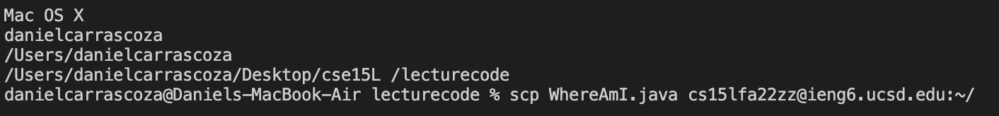
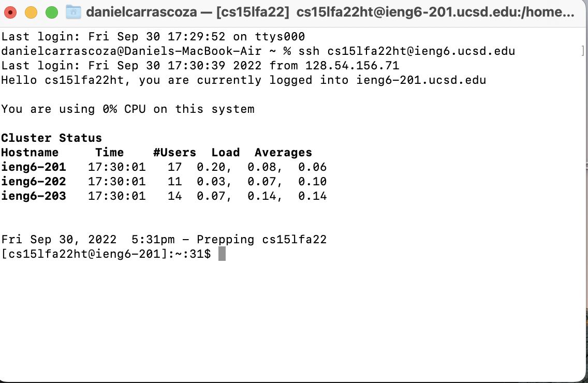

# Lab Report 1

## Step 1

__Installing VS Code:__

To Install VS code, I went to the VS code website and downloaded the package. Once downloaded, you should see a page like this.

## Step 2

__Remotely connecting__

In order to successfully connect remotely, I typed in my username, _cs15lfa22ht@ieng6.ucsd.edu_. This, and resetting my password at https://sdacs.ucsd.edu/~icc/index.php, allowed me to login. It took around 15 minutes for my passowrd to reset.

## Step 3 

__Running some Commands__

Running commands on the remote server is simply typing in the command you want in the terminal while you are logged in the server. You can use ls to see what is in your directory the same why it would be on your local device. cd is current directory, so it types where you are in the location of the computer's file system. cp makes a copy of the file, it doesnt work here beacuse there is no file to copy (not listed in). the command cat allwos us to view the conten of a file.

## Step 4

__WhereAmI.java and moving files with scp__

First, I made my file WhereAmI.java and then compiled it to my local computer. I ran into problems in where I was running my file, so I had to make sure that I wasn't running my terminal in the right directory. 
I got this: 

Then I moved this into the remote server by using scp and writing the correct path. 
I was successfull with this step so I got this as my result

## Step 5 

__No password for login__

In order to make it possible to login without an ssh key, you have to create a public and private rsa id. 

Use mkdir in the server to create the directroy where you will store the copied public rsa_id from your designated path.

Following the path given, make sure that you copy the public file into the remote server using the scp command and saving it into. 

After this updated I was able to log in to the server without being prompted to enter a passcode.

## Step 6 

__Remote Running Optimization__

In order for the progam to edit WhereAmI.java in the quickest way possible, having no password prompt and utilizing arrow keys to run the last command used is neccessary. Unfortunately, I was not able to get this under 10 keystrokes, becasue I could't really find a way to type that little. However, having no password and being concious of past commands helped a lot. 