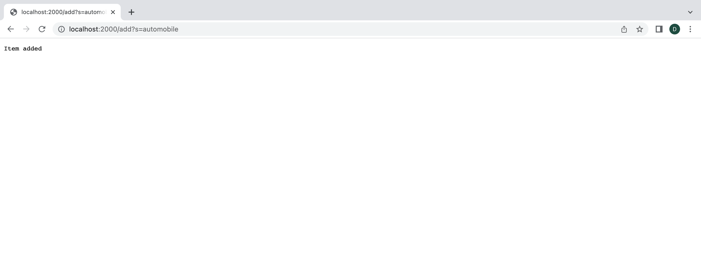
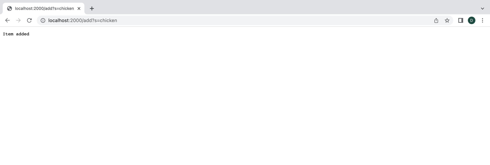
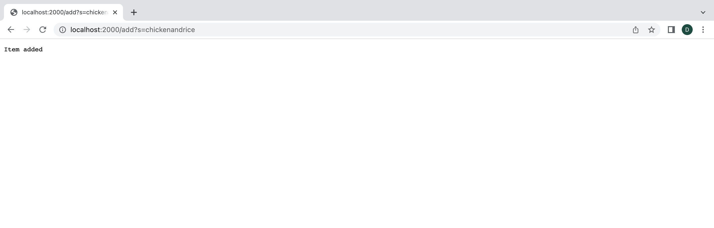
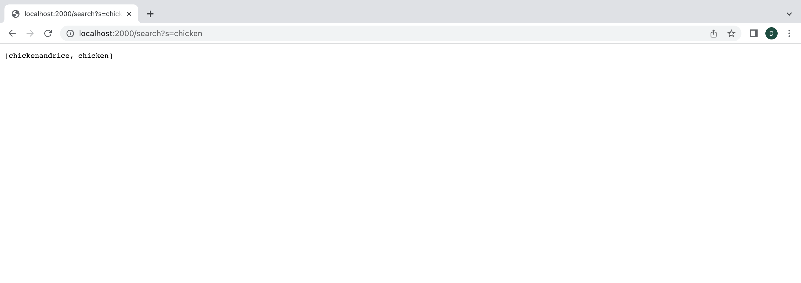
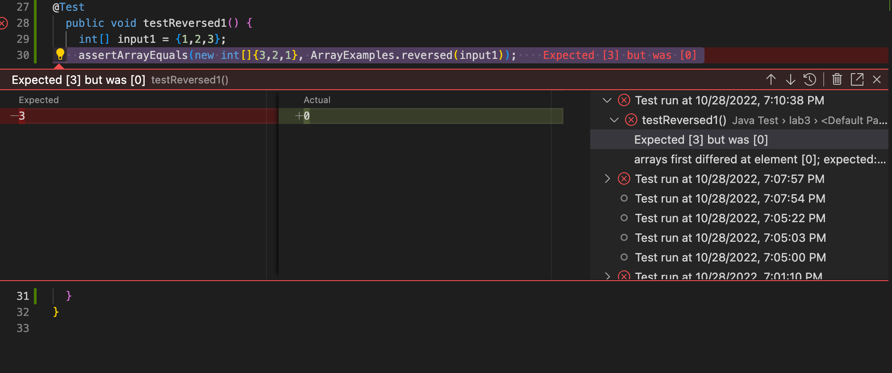
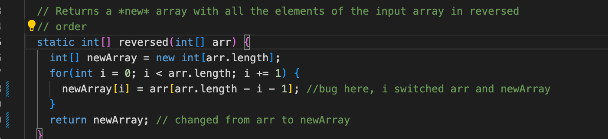
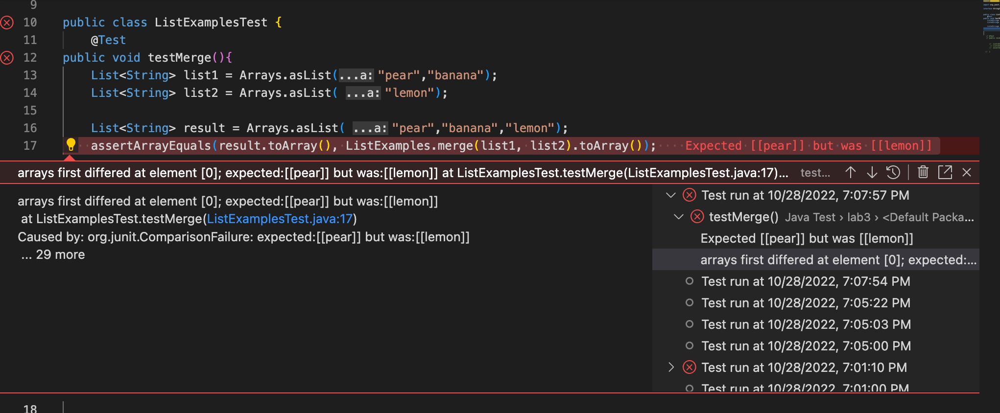
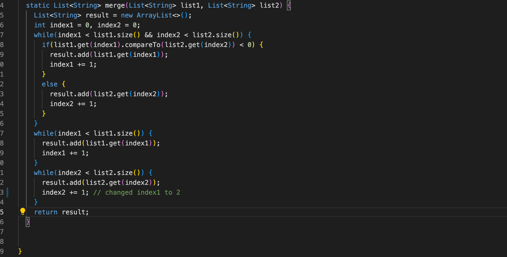

# Lab Report 2

## Part 1

 Search Engine Code:

```
import java.io.IOException; 
import java.net.URI;
import java.util.*;

class Handler implements URLHandler {
    // The one bit of state on the server: a number that will be manipulated by
    // various requests.
  ArrayList<String> items = new ArrayList <String>(); 

  public String handleRequest (URI url) {
    if (url.getPath().equals("/add")) {
        String[] parameters = url.getQuery().split("=");
        if(parameters[0].equals("s")){
                items.add(parameters[1]);
                return String.format("Item added");
            }
        }
    else if (url.getPath().contains("/search")){
        String[] parameters = url.getQuery().split("=");
        ArrayList<String> item = new ArrayList<String>();
        if (parameters[0].equals("s")){
            for(int i=0; i<items.size();i++){
                if(items.get(i).contains(parameters[1])){
                    item.add(0, items.get(i));
                }
            }
        }
        return item.toString();
}
return "404 not found";
    }
}
class SearchEngineServer {
    public static void main(String[] args) throws IOException {
        if(args.length == 0){
            System.out.println("Missing port number! Try any number between 1024 to 49151");
            return;
        }

        int port = Integer.parseInt(args[0]);

        Server.start(port, new Handler());
    }
} 
```
When the URL path contains /add, the code will prepare to add a string value into an arraylist. 
- Here I add automobile as the argument.


- Then I add chicken, and chicken and rice




- The When the URL path contains /search, the code will search through the arraylisy of added items and return what has charecteres that match. Here I search for chicken and get this.



## Part 2

### ArrayExamples.java, ```reversed``` method
- the failure of the code was testing ```[1,2,3]``` to get ```[3,2,1]```.



- the symptom was getting 0 and not 3 when running the test.

- the solution was switching the assignment and to return the right array.
- the newArray continued to remain the same. It was not iniatilized so it was a zero index. By switching and making sure ethat the new array was updated, the code works.

### ListExamples.java, ```merge``` method

- For the test, I tested what should happen when merged, and decided to see what would happen. I foudn that the output gets stuck in a loop, and does not progress. 



- the probelm was the while loop in index2, which was not getting incrememented. Here is the fix:



- the condition now ends when the condition is satisfied.
