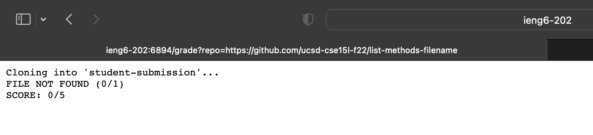
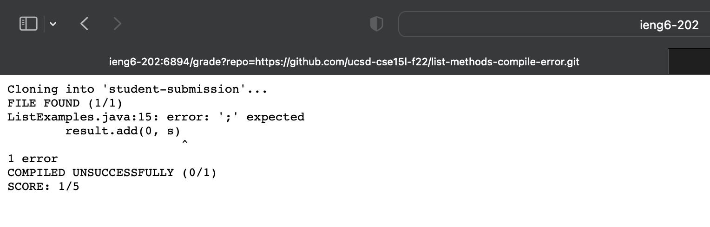

# lab report 5

## grade auto script

```
# Create your grading script here
JUNITPATH=".:/lib/hamcrest-core-1.3.jar:lib/junit-4.13.2.jar"

set -e

rm -rf student-submission
mkdir student-submission
git clone $1 student-submission

cp TestListExamples.java student-submission
cp lib/hamcrest-core-1.3.jar student-submission
cp lib/junit-4.13.2.jar student-submission
cd student-submission


if [[ -f ListExamples.java ]];
then
    echo "FILE FOUND (1/1)"
else
    echo "FILE NOT FOUND (0/1)"
    echo "SCORE: 0/5"
    exit 1
fi

set +e

javac -cp $JUNITPATH *.java > compile-err.txt

if [[ $? -eq 0 ]]
then
    echo "COMPILED SUCCESFFULLY (1/1)"
else
    echo "COMPILED UNSUCCESSFULLY (0/1)"
    echo "SCORE: 1/5"
    cat compile-err.txt
    exit 2
fi

java -cp $JUNITPATH org.junit.runner.JUnitCore TestListExamples > test-err.txt

if [[ $? -eq 0 ]]
then 
    echo "ALL TESTS PASSED"
    echo "SCORE: 5/5"
    exit
else
    echo "TEST FAILED"
    echo "SCORE: 2/5"
    cat test-err.txt
    exit 3
fi
```

### Example 1
- Repository link: [https://github.com/ucsd-cse15l-f22/list-methods-filename](https://github.com/ucsd-cse15l-f22/list-methods-filename)
- This is an example of a file with the wrong name, causing for the script to return a 'file not found' error.

### Example 2 
- Repository link: [https://github.com/ucsd-cse15l-f22/list-methods-compile-error.git](https://github.com/ucsd-cse15l-f22/list-methods-compile-error.git)
- This is an example of a syntax error.

### Example 3
- Repository link: [https://github.com/ucsd-cse15l-f22/list-methods-corrected](https://github.com/ucsd-cse15l-f22/list-methods-corrected)
- This is a method all corrected, so the script returns, 'ALL TESTS PASSED'


## Script Trace:
- JUNITPATH is a path for the junit command
- `set -e` stops the code when the exit code is not 0
- creates a new directory adn removes the previous one, then it cp to move into a new directory
- cd is moving into the student directory
- `-f` command will search through the file, looking for it, and awarding points for it being there. set `+e` command stops the immediate exit.
- javac is the compile command, and then stderr is redirected to `compile-err.txt`. 
- now, using `java` function, we will go throught the tests and will see if the exit code is euqal to zero, if the test-err.txt exists or not. If the exit code is 0, then the grade is 100%.
 