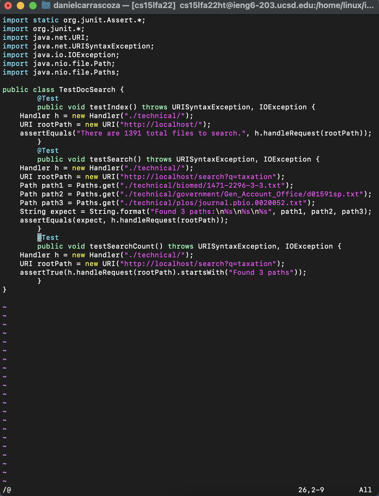
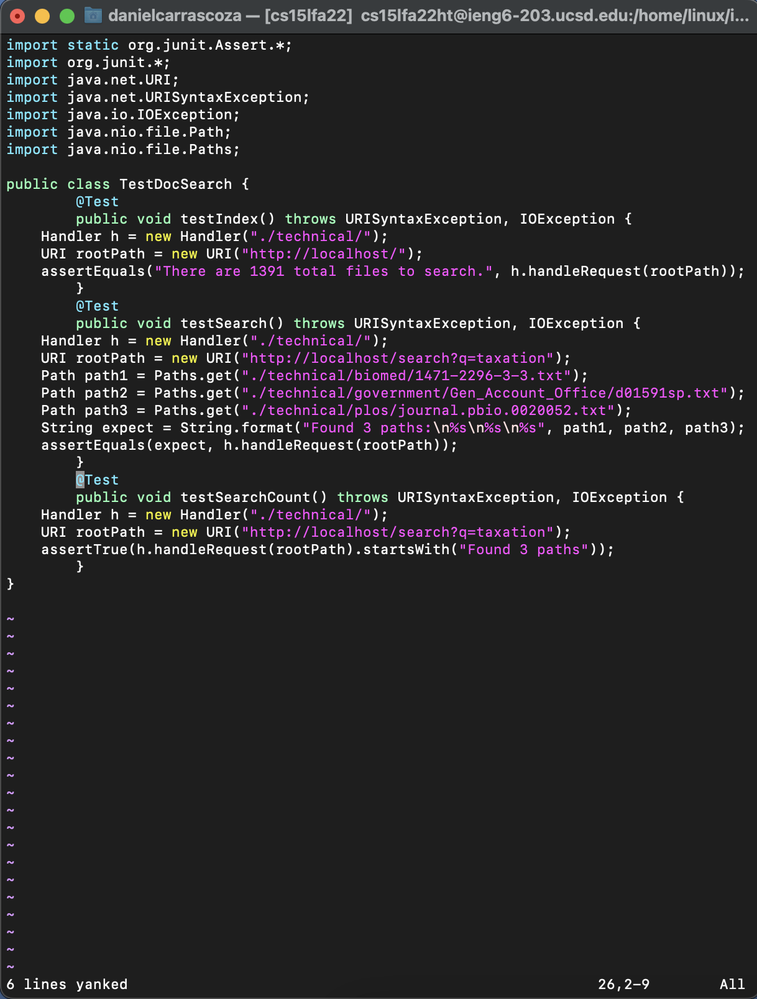
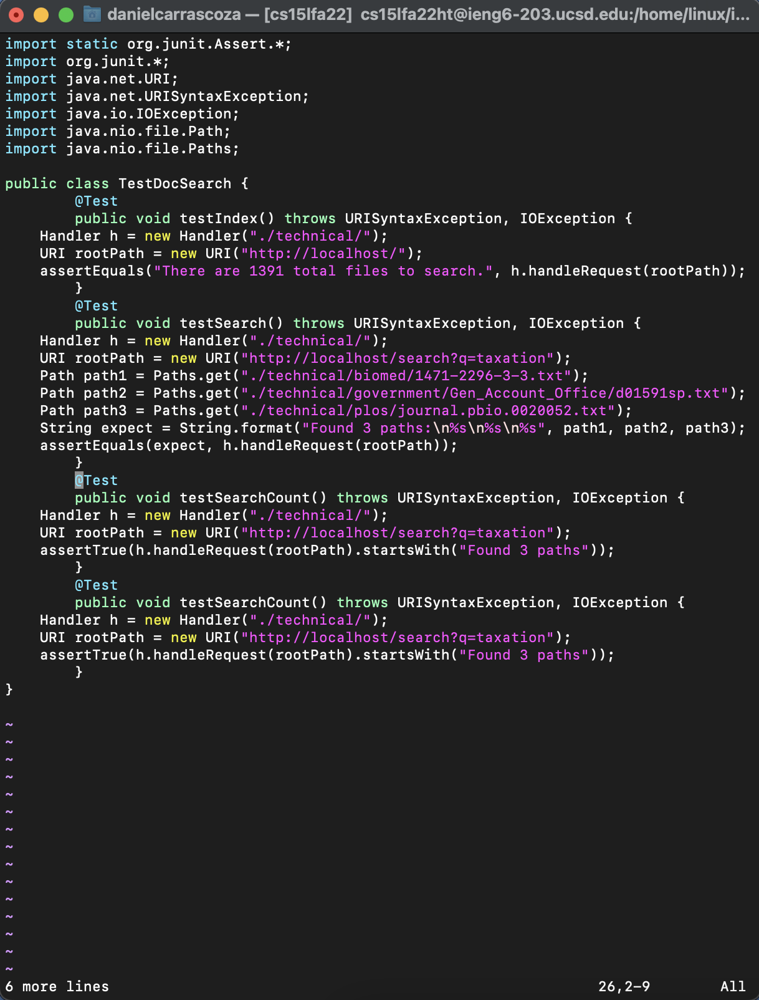
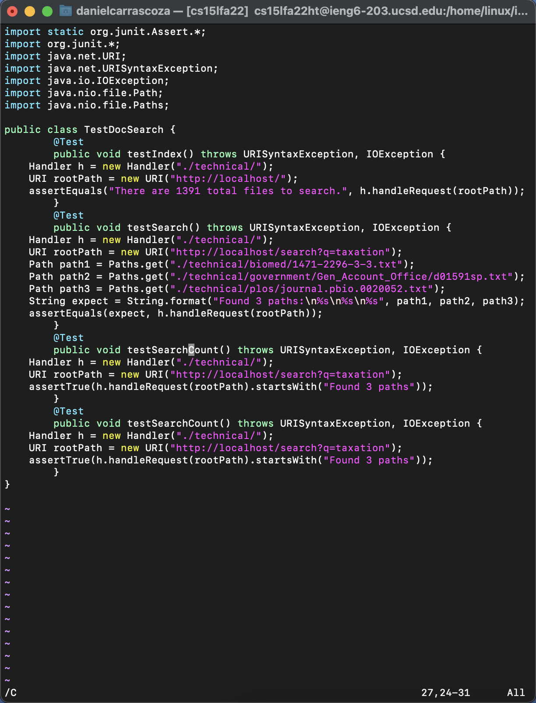
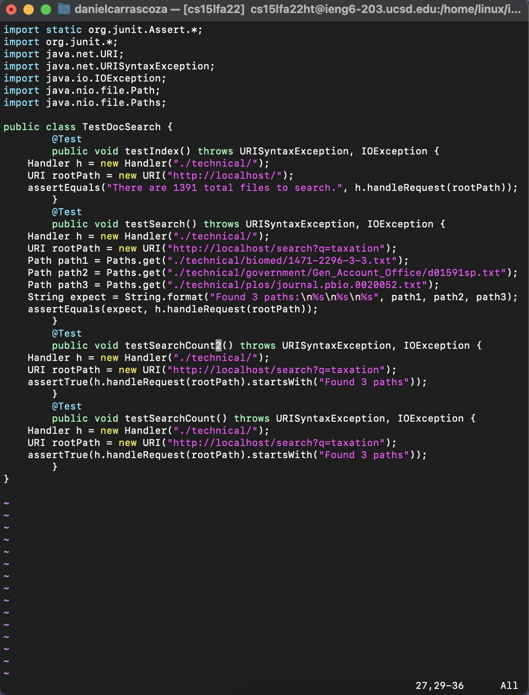
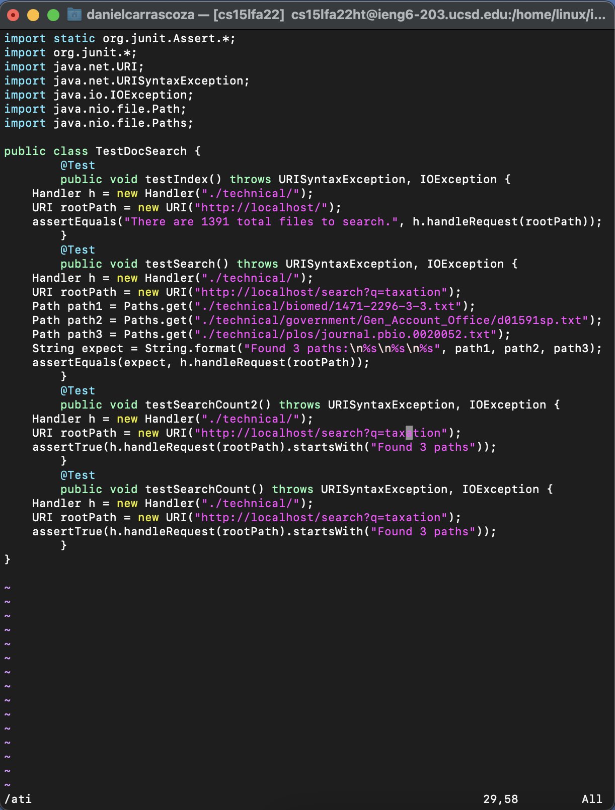
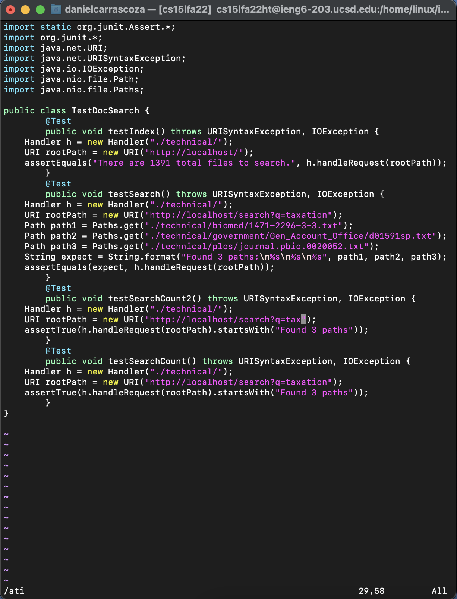
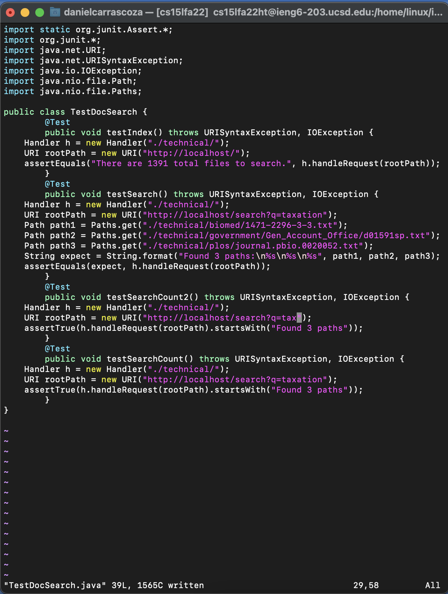

# Lab Report 5

## Part 1 - VIM Tasks

- We chose the challenge task, which was to, in, `TestDocSearch.java, copy the test called testSearchCount, rename the new test to testSearchCount2 and change the query string being tested to tax rather than taxation.`

- STEPS:
1.  `/@ <Enter> nn`

2. `6yy`

3. `kp`

4. `/C <Enter>`

5. `ea2 <Esc>`

6. `/ati <Enter>`

7. `5x`

8. `:w <Enter>`

## Part 2 - Choosing VIM over SCP

### editing in vs code -> scp
- It took me about a minute and a half. This method required me to go into the directroy through the VSCode, which was pretty quick, but the scp process into the remote server took me a little bit to find out. I then had to log into the remote server to run test.sh . 
### editing in remote (VIM)
- It took me about 45 seconds. This method was quicker because it required less keystrokes then the previous one. It also allowed me to run bash right after very quickly.
### The better method
- For work on a remote server, I would use the VIM method. This reduces the amount of steps to take to edit files on a solet remote server. No need to copy from the local to the remote. 

- For projects, I think I would like the comfort of VSCode. It allows to work in a easy to use IDE and to be able to see the directories easier. 